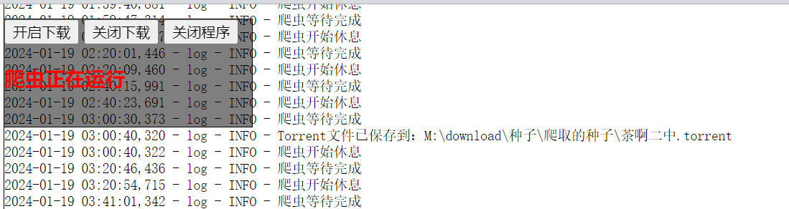

# Movie-BT-downloader
爬取BT之家电影页面下载最新电影种子到本地。

windows系统 双击程序启动.bat
在127.0.0.1:5020上开启一

## 使用方法
save_directory = "d:\爬取的种子"  # 保存目录

target_url = "http://www.btbtt12.com/forum-index-fid-951-page-{}.htm"  # 爬取网址

page_nums = 6  # 爬取页数，默认是4，一页50条

sleep_time = 1200  # 等待时间-默认30分钟

run_status = True  # 爬取状态，默认为True，程序开启时自动开启爬虫。为False时，程序不会开启爬虫。

a_url = 'http://www.btbtt12.com/'

web_post = 5020  # 网站端口

web_host = '127.0.0.1'  # 网站地址

## 注意事项
1. 程序默认爬取最新电影种子到本地，如果需要爬取其他分类电影种子，请修改target_url。
2. 可以配合qt等下载软件自动下载电影本体。

